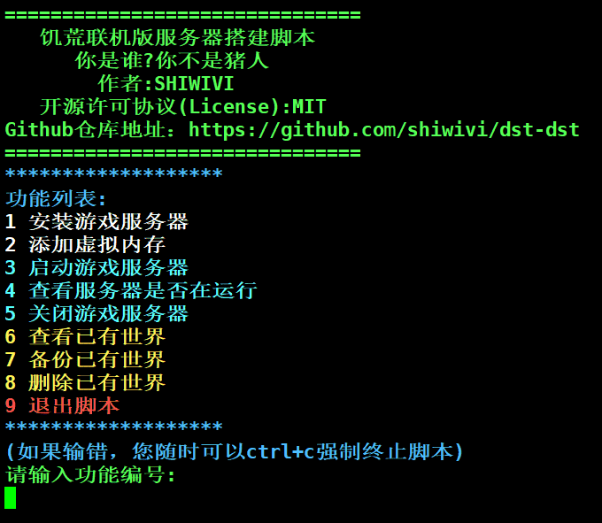

# dst-dst
**Don't Starve Together Dedicated Server Tool (DST-DST)**  
🎮 — 一个用于快速搭建和管理饥荒联机版专用服务器的脚本工具。    

---
## ✨ 功能特性
- 🚀 一键安装 SteamCMD、游戏依赖和饥荒联机版服务端
- 👤 自动创建 `steam` 用户运行steamCMD和游戏进程
- 💾 支持添加 **Swap（虚拟内存）**
- 📑 根据游戏存档检查并添加游戏mod
- 🌍 支持多世界部署
- 🎨 彩色终端提示，简洁直观


---

## 📦 安装与使用
### 前提条件
- 操作系统：**Ubuntu**
- 权限：**root** 或`sudo` 

### 执行脚本

**下载 + 执行**
```bash
# 下载脚本
curl -fsSL https://raw.githubusercontent.com/shiwivi/dst-dst/main/dst-dst.sh -o dst-dst.sh

# 赋予执行权限
chmod +x dst-dst.sh

# 运行脚本(root用户)
./dst-dst.sh

# 或通过sudo执行(普通用户)
sudo ./dst-dst.sh
```
### 安装游戏
- 根据脚本提示安装游戏
- 默认情况下，脚本会创建`steam`用户
- steamCMD和饥荒会被安装在`/home/steam`目录下

### 添加世界存档和令牌文件
1. **生成并上传世界存档**
- 通过饥荒游戏客户端生成世界
- Windows默认存档位置：
```
C:\Users\<用户名>\Documents\Klei\DoNotStarveTogether\<数字文件夹>
```
- 选择要上传的世界存档，通过 ftp 工具上传至服务器目录：
```
/home/steam/klei/DST/
```
2. **获取并上传令牌文件**
- 前往Klei官网生成并下载令牌:<br>
[https://accounts.klei.com/account/game/servers?game=DontStarveTogether](https://accounts.klei.com/account/game/servers?game=DontStarveTogether)

- 将令牌文件`cluster_token.txt`上传到世界存档目录下
- 如果有多个世界存档，每个存档目录下都需要放置令牌文件(可以是同一个令牌文件)，例如：

```
/home/steam/klei/DST/Cluster_1/cluster_token.txt
/home/steam/klei/DST/Cluster_2/cluster_token.txt
```

### 开放端口/配置安全组
需要开放以下端口：
-  **Steam 通讯**
>-  UDP：8767,27016,27017
- **饥荒联机（地面 / 洞穴）**
>-  UDP：10998,10999
+ 多世界请自行修改配置文件并放行端口

### 🎮 启动游戏
完成上述配置后，即可通过脚本启动 DST 服务器

## 许可证

本项目采用 MIT 许可证 - 查看 [LICENSE](LICENSE) 文件了解详情。
